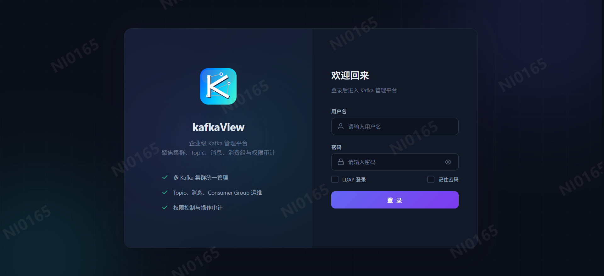
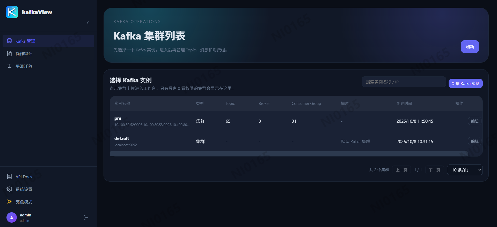
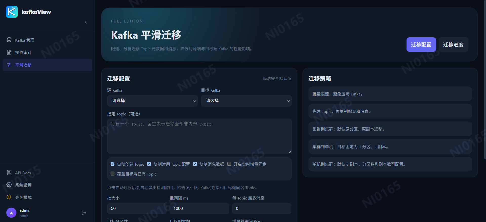

# KafkaVista

KafkaVista is a lightweight operations platform for enterprise Kafka clusters. It brings topic management, message troubleshooting, consumer group operations, fine-grained authorization, audit logging, monitoring alerts, and cluster migration into a single Web console.

As Kafka clusters grow, teams need safer production changes, clearer access boundaries, and traceable operations. KafkaVista reduces direct server or CLI operations and gives developers, operators, and platform teams a unified, auditable Kafka management entry.

## Core Features

### Cluster Management

- **Multi-Cluster Unified Management**: Manage multiple Kafka clusters from one platform with SSL / SASL / SCRAM authentication support.
- **Broker & Topic Panorama**: Real-time visibility into broker status, topic partition distribution, leader replicas, and LogDirs.
- **Topic Lifecycle Management**: Create / delete topics, dynamically adjust partition and replica counts, and modify topic-level configs online.

### Message Inspection

- **Multi-Dimensional Search**: Retrieve messages by time range, Key / Value keywords, single-partition offset, or offset range.
- **Real-Time Message Stream**: SSE long-connection pushes consumed messages without manual refresh.
- **Batch Message Production**: Send messages in bulk to a specified topic for functional validation and load testing.

### Consumer Group Governance

- **Consumer Group Monitoring**: View group members, current offsets, and lag metrics.
- **Offset Management**: Reset consumer offsets to earliest / latest / specific offset, with per-partition precision.
- **Consumer Group Cleanup**: Remove stale consumer groups to keep clusters tidy.

### Authorization & Audit

- **RBAC Fine-Grained Authorization**: Dual-track user-level and role-level authorization, isolated by cluster, with 11 atomic permission actions for flexible composition.
- **Unified Identity**: Built-in LDAP / OIDC (Keycloak) single sign-on with JWT token issuance and renewal.
- **End-to-End Audit Trail**: All mutation operations (topic CRUD, message production, offset resets, user/role changes) are automatically recorded with operator, action, cluster, and time range searchable.

### Monitoring & Alerting

- **Prometheus Metrics Export**: Native `/metrics` endpoint exposing broker, topic partition, and consumer group lag metrics, compatible with Grafana dashboards.
- **Built-in Alerting Engine**: 9 out-of-the-box alert rules (consumer group lag, broker offline, under-replicated partitions, offline partitions, etc.) with 60s cooldown deduplication.
- **Multi-Channel Notifications**: DingTalk Markdown, Feishu Interactive Cards, SMTP email, external webhooks, with notification testing.

### Smooth Kafka Migration

- **Cluster-to-Cluster Migration**: Full replication of topic metadata (partitions, replicas, configs) and message data from source to target cluster.
- **Real-Time Incremental Sync**: Switch to incremental mode after full migration to continuously catch up with the latest source messages.
- **Throttled Batching**: Configurable batch size, batch interval, and max messages per topic to minimize performance impact on source and target clusters.
- **Migration Progress Visualization**: Frontend polls migration task status in real time, showing per-topic copy progress and anomaly alerts.

> Migration note: Kafka producers cannot specify target offsets, so target offset values are not guaranteed to match source offsets after migration.

## Quick Start

One-click install scripts are provided at the project root, auto-detecting the environment and selecting the best deployment method:

**Linux / macOS:**

```bash
chmod +x install.sh
./install.sh              # Auto-detect environment, choose best deployment
./install.sh --docker     # Docker Compose deployment
./install.sh --source     # Build from source
./install.sh --dev        # Local development mode (hot reload)
./install.sh --help       # Show help
```

**Windows PowerShell:**

```powershell
.\install.ps1                          # Auto-detect
.\install.ps1 -Mode docker              # Docker Compose
.\install.ps1 -Mode source              # Build from source
.\install.ps1 -Mode dev                # Development mode
.\install.ps1 -KafkaServers "broker:9092" -AdminPassword "mypass"
```

The script will: detect Go/Node/Docker versions → generate JWT secret → create `.env` config → build and start services → health check → print access URLs.

> For manual deployment, see the [Deployment](#deployment) section below.

## Platform Screenshots

<table>
  <tr>
    <td width="50%" align="center"><b>Login Page</b></td>
    <td width="50%" align="center"><b>Kafka Cluster List</b></td>
  </tr>
  <tr>
    <td></td>
    <td></td>
  </tr>
  <tr>
    <td colspan="2" align="center"><b>Kafka Smooth Migration</b></td>
  </tr>
  <tr>
    <td colspan="2"></td>
  </tr>
</table>

## Source Directory

| Path | Description |
|---|---|
| `install.sh` | One-click install script (Linux / macOS) |
| `install.ps1` | One-click install script (Windows) |
| `docker-compose.yml` | Docker Compose orchestration (Web `3004`, API `8080`) |
| `app/server/` | Go 1.26 + Gin backend API |
| `app/web/` | Vue 3 + Vite frontend |
| `app/server/Dockerfile` | Backend image build |
| `app/web/Dockerfile` | Frontend image build |
| `app/web/nginx.conf` | Frontend Nginx config (includes API proxy) |

## Requirements

- Go >= 1.26 (see `app/server/go.mod`)
- Node >= 18, npm >= 9
- Docker >= 20.10 (when deploying with Docker)
- Docker Compose >= 2.0 (when deploying with Compose)

---

## Deployment

### Option 1: Docker Compose Deployment (Recommended)

**Step 1: Create `.env` config file (optional)**

Create a `.env` file in the project root directory and adjust settings as needed:

```bash
# Run in project root
cat > .env <<'EOF'
JWT_SECRET=change-me-in-production
AUTH_DEFAULT_USER=admin
AUTH_DEFAULT_PASSWORD=admin
KAFKA_CLUSTER_NAME=default
KAFKA_BOOTSTRAP_SERVERS=localhost:9092
CORS_ALLOWED_ORIGINS=
EOF
```

**Step 2: Create data directory**

```bash
mkdir -p /data/local/kafkaVista/data
```

**Step 3: Pull images and start**

```bash
# Run in project root (docker-compose.yml is at root)
docker compose pull
docker compose up -d --remove-orphans
```

> Images are pulled from Alibaba Cloud Container Registry (ACR), no local build required. To build from source, see [Option 2](#option-2-docker-manual-image-build).

**Step 4: Access**

| Service | URL | Notes |
|---|---|---|
| Frontend | `http://localhost:3004` | Nginx serving static files |
| Backend API | `http://localhost:8080` | Go backend + SQLite |
| Default Account | `admin` / `admin` | Change password after first login |

Data is persisted on the host at `/data/local/kafkaVista/data`, with the SQLite database file `kafkavista.db`.

**Environment Variables** (set in `.env` file or via `docker compose` command):

| Variable | Default | Description |
|---|---|---|
| `JWT_SECRET` | `change-me-in-production` | JWT signing secret, **must change in production** |
| `AUTH_DEFAULT_USER` | `admin` | Default admin username |
| `AUTH_DEFAULT_PASSWORD` | `admin` | Default admin password |
| `KAFKA_CLUSTER_NAME` | `default` | Initial Kafka cluster name |
| `KAFKA_BOOTSTRAP_SERVERS` | `localhost:9092` | Initial Kafka cluster address |
| `KAFKA_REQUEST_TIMEOUT_MS` | `6000` | Kafka request timeout (ms) |
| `KAFKA_MAX_POLL_RECORDS` | `50000` | Max records per poll |
| `KAFKA_MAX_VALUE_LENGTH` | `1048576` | Max message value length (bytes) |
| `CORS_ALLOWED_ORIGINS` | (empty) | CORS whitelist, comma-separated, defaults to `localhost:3000` |
| `EMAIL_SMTP_HOST` | (empty) | Alert email SMTP host |
| `EMAIL_SMTP_PORT` | `587` | Alert email SMTP port |
| `EMAIL_SMTP_USERNAME` | (empty) | Alert email username |
| `EMAIL_SMTP_PASSWORD` | (empty) | Alert email password |
| `EMAIL_FROM` | (empty) | Sender address |
| `EMAIL_TO` | (empty) | Recipient address |
| `EMAIL_USE_TLS` | `false` | Enable TLS |

**Logs and stop:**

```bash
docker compose logs -f                    # View all service logs
docker compose logs -f kafkavista-server   # Backend logs only
docker compose down                       # Stop and remove containers
docker compose pull && docker compose up -d  # Pull latest images and restart
```

### Option 2: Docker Manual Image Build

**Step 1: Build backend image**

```bash
docker build -t kafkavista-server:latest -f app/server/Dockerfile app/server/
```

**Step 2: Build frontend image**

```bash
docker build -t kafkavista-web:latest -f app/web/Dockerfile app/web/
```

**Step 3: Create Docker network**

```bash
docker network create kafkavista-net
```

**Step 4: Start backend container**

```bash
docker run -d \
  --name kafkavista-server \
  --restart unless-stopped \
  --network kafkavista-net \
  -p 8080:8080 \
  -v /data/local/kafkaVista/data:/app/data \
  -e JWT_SECRET="your-secret-key" \
  -e AUTH_DEFAULT_USER=admin \
  -e AUTH_DEFAULT_PASSWORD=admin \
  -e KAFKA_BOOTSTRAP_SERVERS=broker1:9092 \
  crpi-y1il03c3mx8rejur.cn-hangzhou.personal.cr.aliyuncs.com/aisoftkit/kafkavista-server:latest
```

**Step 5: Start frontend container**

```bash
docker run -d \
  --name kafkavista-web \
  --restart unless-stopped \
  --network kafkavista-net \
  -p 3004:80 \
  crpi-y1il03c3mx8rejur.cn-hangzhou.personal.cr.aliyuncs.com/aisoftkit/kafkavista-web:latest
```

> The frontend Nginx config (`app/web/nginx.conf`) proxies `/api` and `/kafka-api` to `http://kafkavista-server:8080`. Use `--network` to ensure container connectivity.

### Option 3: Build from Source

**Step 1: Build Go backend**

```bash
cd app/server

# Download dependencies
export GOPROXY=https://goproxy.cn,direct
export GOSUMDB=sum.golang.google.cn
go mod download

# Build binary (Linux)
CGO_ENABLED=0 GOOS=linux GOARCH=amd64 go build -trimpath -ldflags="-s -w" -o kafkavista ./cmd/kafkavista

# Build binary (macOS Apple Silicon)
CGO_ENABLED=0 GOOS=darwin GOARCH=arm64 go build -trimpath -ldflags="-s -w" -o kafkavista ./cmd/kafkavista

# Build binary (Windows PowerShell)
$env:CGO_ENABLED=0; $env:GOOS="windows"; $env:GOARCH="amd64"
go build -trimpath -ldflags="-s -w" -o kafkavista.exe ./cmd/kafkavista
```

**Step 2: Build Node frontend**

```bash
cd app/web

# Install dependencies
npm install

# Production build (output to dist/)
npm run build
```

Build artifacts are in the `app/web/dist/` directory.

**Step 3: Start backend**

```bash
# Create data directory
mkdir -p /app/data

# Set environment variables (JWT_SECRET is required)
export HTTP_ADDR=:8080
export KAFKA_DATABASE_PATH=/app/data/kafkavista.db
export JWT_SECRET=your-secret-key
export AUTH_DEFAULT_PASSWORD=admin

# Start
./kafkavista
```

**Step 4: Serve frontend with Nginx**

Deploy the `app/web/dist/` directory to Nginx with the following config:

```nginx
server {
    listen 80;
    root /usr/share/nginx/html;
    index index.html;

    location / {
        try_files $uri $uri/ /index.html;
    }

    location /api {
        proxy_pass http://127.0.0.1:8080;
        proxy_set_header Host $host;
        proxy_set_header X-Real-IP $remote_addr;
    }

    location /kafka-api {
        proxy_pass http://127.0.0.1:8080;
        proxy_set_header Host $host;
    }

    location /metrics {
        proxy_pass http://127.0.0.1:8080;
    }
}
```

---

## Local Development

Backend hot reload:

```bash
cd app/server
GOPROXY=https://goproxy.cn,direct GOSUMDB=sum.golang.google.cn go run ./cmd/kafkavista
```

Specify backend port:

```bash
./kafkavista --port 8081
./kafkavista --addr :8081
HTTP_ADDR=:8081 ./kafkavista
```

Frontend hot reload:

```bash
cd app/web
npm install
npm run dev
```

The frontend dev server listens on `http://localhost:3000` and proxies API requests to `http://localhost:8080` via Vite.

